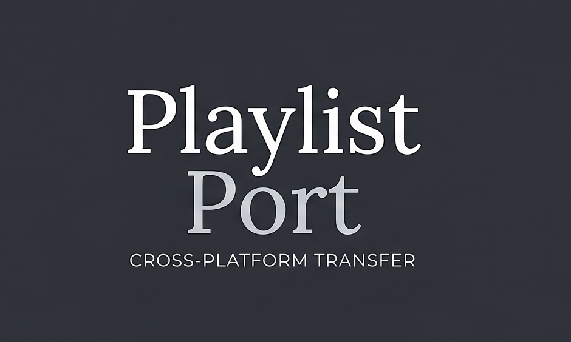

<p align="center">
  
</p>

<p align="center">
  <a href="https://github.com/Ande404/playlistport/actions/workflows/ci.yml">
    
  </a>
  
  
</p>

# PlaylistPort

Transfer playlists between Spotify and YouTube Music, from the command line, on
your own machine, with your own API credentials.

There are plenty of tools that do this. What is unusual here is that the match
quality is **measured** rather than asserted, and the failure modes are
**documented** rather than hidden.

---

## Measured results

Spotify → YouTube Music, **2,471 tracks across 8 real playlists**:

| Playlist | Tracks | Auto | Review | Not on target |
| --- | ---: | ---: | ---: | ---: |
| love-vibes | 374 | 97.6% | 1.9% | 0.5% |
| Gym hardcore | 141 | 97.2% | 2.8% | 0% |
| Dancehall vibe | 181 | 96.7% | 3.3% | 0% |
| RapReloaded | 351 | 96.3% | 2.6% | 1.1% |
| African Speciale | 893 | 93.5% | 5.6% | 0.9% |
| Chill-Afro | 303 | 93.4% | 5.0% | 1.7% |
| 90s blast | 117 | 92.3% | 7.7% | 0% |
| Electro Waves | 111 | 88.3% | 9.0% | 2.7% |
| **Total** | **2,471** | **94.7%** | **4.5%** | **0.9%** |

**Zero false positives.** Of 2,339 automatic matches, 18 had any weak scoring
component; all 18 were checked by hand and all were correct — every one an
artist spelling variant (`Hotkeed`/`Hotkid`, `Eugy Official`/`Eugy`,
`Diddy`/`Puff Daddy`).

Electronic music scores lowest, which is expected: remix and edit credits vary
most between platforms.

**The reverse direction is much worse — 35% automatic** — and that is a property
of the data, not a bug. See [Limitations](#limitations).

## What it guarantees

These are enforced by the database schema rather than by careful coding, and
each is covered by tests:

| Property | Meaning |
| --- | --- |
| **Resumable** | One durable row per track. `Ctrl-C`, a dropped connection or an exhausted quota costs at most one in-flight item. |
| **Idempotent** | Re-running never duplicates. Tracks already in the target playlist are recognised across jobs, not merely within one. |
| **Quota-aware** | Hitting YouTube's daily ceiling *pauses* a job with its remaining work intact. Re-run the next day to continue. |
| **Append-only** | Re-running adds new tracks and never removes anything you added to the target by hand. |
| **Self-improving** | Every confident match and every review decision — including "no match exists" — is cached and reused across playlists forever. |
| **De-duplicated** | Distinct source tracks that resolve to the same target video are written once, and `dedupe` cleans up playlists written before that guard existed. |

## Install

Requires Python 3.11+.

```bash
git clone https://github.com/Ande404/playlistport.git
cd playlistport
python3 -m venv .venv
.venv/bin/pip install .
```

> **Developing on Python 3.14?** `pip install -e .` is silently broken there:
> 3.14's `site` module skips `.pth` files whose names begin with `_`, which is
> exactly how setuptools names editable path hooks. `pip list` shows the package
> installed while every import fails with `ModuleNotFoundError`. Either install
> non-editable as above, or prefix commands with `PYTHONPATH=src`.

## Setup

You need your own credentials for both platforms. Nothing is shared, and no
data leaves your machine.

```bash
cp .env.example .env
```

### Spotify

1. Create an app at <https://developer.spotify.com/dashboard>.
2. Add the redirect URI `http://127.0.0.1:8888/callback`.
   **Not `localhost`** — Spotify rejects it.
3. Put the client ID and secret into `.env`.
4. Under *Users and Access*, add your own account. Apps in development mode are
   limited to 25 manually added users.

### Google / YouTube

1. Create a project at <https://console.cloud.google.com>.
2. Enable **YouTube Data API v3**.
3. Create an OAuth client of type **Desktop app**, download the JSON, and save
   it as `.data/google_client_secret.json`.
4. Add your account as a test user on the OAuth consent screen.

> Refresh tokens for unverified apps in *Testing* status **expire after 7 days**.
> Re-run `auth youtube` when that happens; it is expected, not a failure.

## Usage

```bash
playlistport auth spotify
playlistport auth youtube

playlistport playlists spotify --mine      # --mine skips followed playlists

# Match only. Writes nothing, costs no YouTube quota.
# Add --report for a JSON breakdown of every scoring decision.
playlistport transfer --playlist "Roadtrip"

# Resolve ambiguous matches (decisions are cached permanently)
playlistport review 1

# Create the playlist and write the tracks
playlistport transfer --playlist "Roadtrip" --commit

playlistport jobs                          # history and state
```

### Running it on a schedule

A large library takes days: YouTube allows ~198 track writes per day. `drain`
works through every queued job, cheapest first, and stops when the quota is
spent — so one scheduled run per day moves as much as the platform permits.

```bash
playlistport drain            # show what is queued
playlistport drain --commit   # write until the quota runs out
```

`scripts/drain.sh` wraps it with logging, and
`scripts/com.playlistport.drain.plist` is a launchd agent template:

```bash
sed "s|__REPO__|$PWD|g" scripts/com.playlistport.drain.plist \
  > ~/Library/LaunchAgents/com.playlistport.drain.plist
launchctl load ~/Library/LaunchAgents/com.playlistport.drain.plist
```

Two things worth knowing before automating:

- **Use launchd, not cron.** cron skips a job entirely if the Mac was asleep at
  the scheduled time; launchd runs it on wake.
- **Publish your OAuth consent screen first.** While it is in *Testing*, Google
  expires refresh tokens after **7 days**, so any schedule stops working within
  a week. Publishing the app (it can stay unverified) removes that expiry.

Scheduling the run for a time you are actually at the machine is deliberate: the
most likely failure is an expired token, and fixing it needs a browser.

Other options:

```bash
# Reverse direction, and Liked Songs / saved library
playlistport transfer --source youtube --target spotify --playlist "Mix"
playlistport transfer --saved --limit 50

# Write a JSON match-quality report alongside the run
playlistport transfer --playlist "Roadtrip" --report

# Remove repeated occurrences of a track (keeps the earliest copy)
playlistport dedupe --playlist "Roadtrip"
playlistport dedupe --playlist "Roadtrip" --commit
```

`--playlist` accepts an ID, an exact name, or a unique case-insensitive
substring.

### Reviewing

`review` shows each ambiguous track with its candidates:

| Key | Effect |
| --- | --- |
| `1`–`4` | Accept that candidate (1 is the best guess) |
| `Enter` | Skip for now; it will be asked again |
| `n` | No match exists — recorded permanently, never asked again |
| `q` | Quit, keeping everything already decided |

Decisions attach to the **track**, not the job, so answering once settles it for
every playlist that track appears in.

## YouTube vs YouTube Music

The destination is **YouTube Music**. The API written to is **YouTube**. That is
not sloppiness — it is the only route available, and it shapes the whole design.

There is no official YouTube Music API. What exists is the YouTube Data API, and
the two products share one Google account and one playlist store: **a playlist
created through the YouTube Data API appears in YouTube Music's library.** So
writes go to YouTube, and the result shows up where you actually want it.

The catch is *what* you write. A playlist item is a video id, and an arbitrary
video id gives you a video — a lyric upload, a live cut, an 8-hour loop — not a
song. Searching YouTube proper returns exactly those.

So the two halves address different catalogues on purpose:

| Step | Surface | Why |
| --- | --- | --- |
| **Find the track** | YouTube **Music** catalogue, via `ytmusicapi` | Returns song entries with real artist, album and duration fields — and the video ids it returns are music-catalogue entries, so they render as songs |
| **Write the playlist** | YouTube Data API | The only authenticated write path, and what makes the playlist appear in YouTube Music |

This is why the hybrid exists. The quota arithmetic below reinforces it, but even
with unlimited quota the search would still go through the music catalogue,
because searching YouTube proper returns the wrong *kind* of result.

The provider is named `youtube` throughout the code and CLI because that is the
API surface being authenticated and written to. The catalogue being matched
against is YouTube Music.

## The YouTube quota, and why the design is shaped around it

The YouTube Data API allows **10,000 units per day**, and that budget belongs to
the *application*, not to each user.

| Call | Units |
| --- | --- |
| `playlists.list` / `playlistItems.list` | 1 |
| `playlists.insert` / `playlistItems.insert` | 50 |
| `search.list` | **100** |

Searching via the official API would cost 150 units per track — about **66
tracks per day**, which is unusable. So search is routed through
[`ytmusicapi`](https://github.com/sigma67/ytmusicapi) instead, **anonymously**:
it costs nothing, and it searches the *music* catalogue, returning song entries
with structured artist, album and duration fields rather than lyric videos and
8-hour loops.

The result: matching is free, and writing costs 50 units per track — about
**198 tracks per day**.

`ytmusicapi` is an unofficial client and never receives credentials. All
authenticated access goes through Google OAuth.

## How matching works

There is no shared identifier between Spotify and YouTube Music, so matching is
fuzzy scoring:

| Signal | Weight |
| --- | --- |
| Title similarity | 0.42 |
| Artist similarity (set overlap, graded) | 0.33 |
| Duration delta | 0.20 |
| Album similarity | 0.05 |

Then subtractive penalties for recording variants present on only one side —
`live`, `acoustic`, `remix`, `sped up` — and a heavier one for `cover` or
`karaoke` mismatch.

Outcomes: **auto** ≥ 0.85 · **needs review** 0.55–0.85 · **unmatched** below.

Where both platforms expose an **ISRC**, that is an exact recording identifier
and short-circuits scoring entirely. YouTube Music does not expose one, so this
currently benefits no supported pair — it is groundwork for Tidal, Deezer or
Apple Music.

Two non-obvious rules that matter:

- **Titles are normalised pairwise, not in isolation.** No fixed noise list can
  enumerate every one-sided qualifier, so a bracket group is dropped when it is
  both absent from the other title *and* free of variant tags. `(Live)` and
  `(Skrillex Remix)` carry variant tags and always survive, so this can never
  collapse a studio cut onto a live recording.
- **Searching and matching want opposite things.** Matching needs every
  qualifier so it can reject a live take; searching needs the shortest
  unambiguous phrase, because search engines degrade badly with noise. They are
  separate code paths.

## Reading a report

Every non-automatic track carries a reason:

| Reason | Meaning |
| --- | --- |
| `low_confidence` | Candidates were found but none scored high enough. **A human can resolve this.** |
| `absent` | Nothing resembling the track came back. It almost certainly does not exist on the target platform. Review cannot recover it. |

Keeping these apart matters: a playlist that is half DJ sets is not the same as
a matcher that is failing.

## Architecture

```
src/playlistport/
  providers/     base.py — the entire contract; spotify.py; youtube.py
  core/          models, normalize, matcher, jobs (fetch → match → review → write)
  db/            SQLAlchemy + SQLite
```

Nothing outside `providers/` knows that Spotify or YouTube exist. That is what
keeps the matcher testable without a network and makes a new platform a plugin
rather than a rewrite — see [docs/adding-a-provider.md](docs/adding-a-provider.md).

[DESIGN.md](DESIGN.md) documents the trade-offs, the bugs that live data
exposed, and why each decision was made.

## Tests

```bash
pytest
```

92 tests, fully offline — providers are faked and the matcher is pure, so no
credentials are needed. The interesting ones encode real failure modes rather
than happy paths: a live recording must never be auto-matched to a studio cut,
a re-run must write nothing, a quota pause must resume without duplicating.

## Limitations

Stated plainly, because they are properties of the platforms:

- **YouTube → Spotify is weak (≈35% automatic).** A YouTube "liked song" is
  often a video whose artist field is an uploader channel, and much of what
  people save there — DJ sets, live uploads, drone footage — has no counterpart
  on a licensed service at all. Around half of a real sample was genuinely
  absent rather than mismatched.
- **Spotify cannot read algorithmic playlists.** Discover Weekly, Daily Mix and
  Release Radar are unavailable to new apps. Only owned and followed playlists.
- **Writing is capped at ~198 tracks/day** by YouTube quota. Large playlists
  span days; jobs pause and resume automatically.
- **Spotify apps are capped at 25 users** in development mode, which is why this
  is a self-hosted tool and not a hosted service.
- **Sync is append-only.** Removing a track from the source does not remove it
  from the target. This is deliberate: treating the source as absolute truth
  would delete tracks you added to the target by hand, which is unrecoverable.
  Use `dedupe` for the one removal case the tool automates.
- **`ytmusicapi` is unofficial** and can break when YouTube changes. It is
  isolated behind the provider interface and never receives credentials.

## License

MIT — see [LICENSE](LICENSE).
